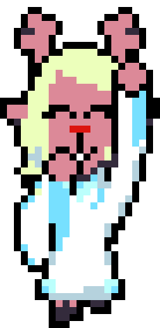

<h1 align="center">
  Hello!!!
  
</h1>

    

[Website](https://priax.org) &middot;
[Bluesky](https://bsky.app/profile/priax.org) &middot; 
[Twitter](https://x.com/Prime_Axiom) &middot; 
[LinkedIn](https://www.linkedin.com/in/montero-fontaine/) &middot; 
[Email](mailto:vincent.monterofontaine1@gmail.com)

I am Priax, a french developer that loves learning ! I studied at [Epitech](https://www.epitech.eu/) and Tsinghua University in Beijing, China. 
In my free time, I code, play indie game, do roller skating. 
I am also currently learning violin!

I am a part of [DeltaruneFR](https://deltarune-fr.com), I was one of the founder member and worked on it since 2018.

I am currently working on:
* **Puyorust**: A multiplayer puyo like game in Rust !
* **Butterfly**: A messenger app
* An insect sound maker (embedded programming)
* **Sylvestre**: An animal data gathering app

💻 My website and portfolio: [priax.org](https://priax.org) 
Don't hesitate to look at my projects on github :3

You can contact me on discord, my pseudonym is `priax`

    

  
  
  
  
  
  &nbsp;
  &nbsp;
  &nbsp;
  &nbsp;
  &nbsp;
  &nbsp;
  &nbsp;
  
  
  
  
  
  

